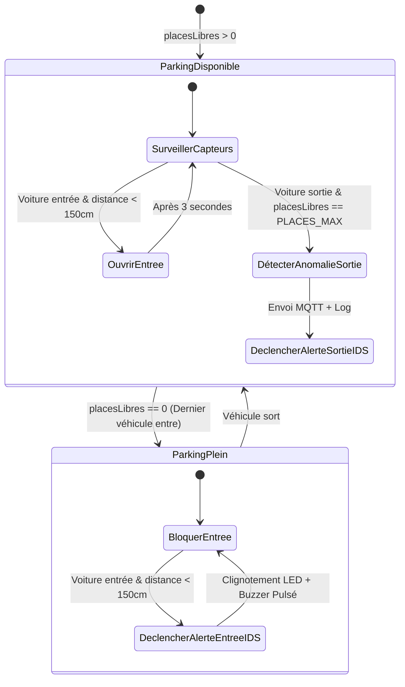

# RAPPORT TECHNIQUE DE PROJET DE FIN D'ÉTUDES
## *Système Distribué d'IoT Smart Parking avec Détection d'Intrusion Embarquée (Edge IDS)*

---

### **INFORMATIONS ACADÉMIQUES**
* **Université :** Université Félix Houphouët-Boigny – Abidjan, Côte d'Ivoire
* **UFR :** Mathématiques et Informatique
* **Classe :** Licence 3 Réseaux, Sécurité et Télécommunications (L3 RIST)
* **Module :** Création de Services Réseaux et Internet des Objets (IoT)
* **Superviseur :** Dr. Konaté
* **Date de Réalisation :** Juin 2026

---

### **ÉQUIPE PROJET (GROUPE D)**
1. **AGBENONZAN Kossivi Jacques Junior** (GitHub: [JunRoot29](https://github.com/JunRoot29))
2. **KONE Kpantieri**
3. **HORO Désiré**

---

## 📖 TABLE DES MATIÈRES
1. [Introduction & Contexte](#1-introduction--contexte)
2. [Cahier des Charges & Objectifs](#2-cahier-des-charges--objectifs)
3. [Architecture Générale du Système](#3-architecture-générale-du-système)
4. [Raccordement Matériel & GPIO Mapping](#4-raccordement-matériel--gpio-mapping)
5. [Conception et Logique Embarquée (ESP32)](#5-conception-et-logique-embarquée-esp32)
6. [Système de Détection d'Intrusions (Edge IDS)](#6-système-de-détection-dintrusions-edge-ids)
7. [Couche Transport Réseau (MQTT)](#7-couche-transport-réseau-mqtt)
8. [Couche Traitement ETL (Node-RED)](#8-couche-traitement-etl-node-red)
9. [Couche Stockage Temporel (InfluxDB v2)](#9-couche-stockage-temporel-influxdb-v2)
10. [Couche Observabilité (Grafana)](#10-couche-observabilité-grafana)
11. [Conteneurisation & Déploiement (Docker Compose)](#11-conteneurisation--déploiement-docker-compose)
12. [Analyse, Compétences Acquises et Perspectives](#12-analyse-compétences-acquises-et-perspectives)
13. [Conclusion](#13-conclusion)

---

## 1. Introduction & Contexte

Dans le cadre des initiatives de développement des villes intelligentes (*Smart Cities*) et de modernisation des infrastructures universitaires, la gestion de l'espace de stationnement routier constitue un défi majeur. La recherche d'une place de parking disponible génère des pertes de temps considérables, augmente l'empreinte carbone et perturbe la fluidité du trafic. 

Parallèlement, la sécurité physique des accès au parking est souvent sous-estimée. Les forçages manuels de barrières, les fraudes d'accès lors de la saturation du parking et l'absence de journalisation d'événements représentent des vulnérabilités de sécurité critiques.

Le projet **IoT Smart Parking & Edge Security Monitoring System** répond à cette double problématique. Il propose une solution IoT distribuée complète, capable de :
* Gérer l'occupation dynamique d'un parking de manière automatisée.
* Surveiller en temps réel les facteurs physiques et environnementaux.
* Détecter les menaces et fraudes d'accès directement en périphérie du réseau (*Edge Computing*), garantissant une protection autonome et ultra-rapide.
* Offrir une centralisation complète des métriques à travers des solutions d'observabilité de niveau industriel.

---

## 2. Cahier des Charges & Objectifs

Le projet doit respecter un cahier des charges strict, divisé en exigences fonctionnelles, exigences de sécurité et contraintes techniques :

### A. Exigences Fonctionnelles
* **Guidage dynamique :** Affichage local interactif (LCD) de la disponibilité des places et signalisation lumineuse (LEDs rouge/verte).
* **Automatisation physique :** Ouverture et fermeture automatique des barrières d'accès (servomoteurs) déclenchées par l'approche de véhicules (capteurs de distance).
* **Superviser l'environnement :** Mesurer périodiquement la température et l'humidité ambiantes dans le parking pour prévenir d'éventuels risques (incendies, inondations).
* **Interface centrale :** Fournir des tableaux de bord dynamiques résumant les statistiques d'utilisation du parking.

### B. Exigences de Sécurité (Edge IDS)
* **Détection du forçage de l'accès :** Identifier immédiatement si un véhicule tente de s'introduire alors que le parking est plein.
* **Détection des anomalies de sortie :** Repérer les anomalies telles que la sortie de véhicules suspectés lorsque le parking est théoriquement vide.
* **Mécanisme d'alarme :** Activer instantanément des signaux sonores (buzzer) et visuels (LED rouge clignotante) locaux et expédier un rapport d'alerte réseau.

### C. Contraintes Techniques
* **Traitement distribué :** L'intelligence de détection doit être embarquée sur l'ESP32 (*Edge Computing*) pour éviter la latence réseau.
* **Formatage des flux :** Les transferts de données doivent utiliser un format standardisé de sérialisation (**JSON**) acheminé par protocole léger (**MQTT**).
* **Gestion DevOps :** L'ensemble de la pile applicative (ETL, bases de données, visualisation) doit être orchestré sous forme de conteneurs pour garantir la portabilité.

---

## 3. Architecture Générale du Système

Le système repose sur une architecture IoT en cinq couches distinctes :

1. **La Couche Perception & Edge (Matériel) :** Représentée par un microcontrôleur **ESP32** qui collecte les mesures des capteurs (HC-SR04, DHT22) et commande les actionneurs (servomoteurs, écran LCD, LEDs, buzzer). Il héberge le moteur de détection Edge IDS.
2. **La Couche Transport Réseau :** Utilise le protocole **MQTT** via un broker cloud public (**HiveMQ**) pour connecter le simulateur en ligne Wokwi aux infrastructures de calcul locales.
3. **La Couche Extraction et Routage (ETL) :** Développée sous **Node-RED**, elle souscrit aux flux MQTT de télémétrie et d'alertes, nettoie les données, convertit les types et les achemine.
4. **La Couche Stockage (Base de données temporelle) :** Alimentée par **InfluxDB v2**, elle stocke de manière optimisée les séries de données associées aux événements, à la télémétrie et aux alertes IDS.
5. **La Couche Présentation (Visualisation) :** Fournie par **Grafana**, qui interroge InfluxDB pour construire des tableaux de bord interactifs.

```text
  ┌────────────────────────────────────────────────────────┐
  │                   COUCHE PERCEPTION (ESP32)            │
  │   - Capteur Entrée / Sortie (Ultrasons HC-SR04)        │
  │   - Capteur Environnemental (DHT22 Temp & Humidité)    │
  │   - Actionneurs Locaux (Buzzer, LEDs, Servomoteurs)    │
  │   - Logique Intégrée : Edge IDS (Détection Intrusion) │
  └───────────────────────────┬────────────────────────────┘
                              │ Connexion WiFi
                              │ MQTT Publish (JSON) - Port 1883
                              ▼
  ┌────────────────────────────────────────────────────────┐
  │                   COUCHE TRANSPORT (HiveMQ)            │
  │   - Broker MQTT Cloud Public (broker.hivemq.com)       │
  └───────────────────────────┬────────────────────────────┘
                              │ Connexion Sécurisée
                              │ MQTT Subscribe (TLS) - Port 8883
                              ▼
  ┌────────────────────────────────────────────────────────┐
  │                   COUCHE ETL (Node-RED)                │
  │   - Souscription, Parsing JSON, Validation, Routage    │
  └───────────────────────────┬────────────────────────────┘
                              │ Requêtes d'Écriture HTTP API
                              ▼
  ┌────────────────────────────────────────────────────────┐
  │                   COUCHE STOCKAGE (InfluxDB v2)        │
  │   - Base de données orientée Séries Temporelles        │
  │   - Bucket "smartcampus", Organisation "ufhb"           │
  └───────────────────────────┬────────────────────────────┘
                              │ Langage de Requêtes Flux
                              ▼
  ┌────────────────────────────────────────────────────────┐
  │                 COUCHE VISUALISATION (Grafana)         │
  │   - Dashboards Dynamiques d'Observabilité & Sécurité   │
  └────────────────────────────────────────────────────────┘
```

---

## 4. Raccordement Matériel & GPIO Mapping

Le montage électronique de l'ESP32 a été conçu et configuré sur le simulateur Wokwi de la manière suivante :

| Nom du Composant | Pin ESP32 | Direction | Rôle Technique |
| :--- | :---: | :---: | :--- |
| **HC-SR04 Entrée (TRIG)** | **GPIO 5** | Sortie | Envoi du signal ultrasonique pour l'accès entrée. |
| **HC-SR04 Entrée (ECHO)** | **GPIO 18** | Entrée | Mesure du temps d'écho pour calculer la distance d'accès. |
| **HC-SR04 Sortie (TRIG)** | **GPIO 19** | Sortie | Envoi du signal ultrasonique pour l'accès sortie. |
| **HC-SR04 Sortie (ECHO)** | **GPIO 23** | Entrée | Mesure du temps d'écho pour calculer la distance de sortie. |
| **Servomoteur Entrée** | **GPIO 13** | Sortie (PWM) | Signal PWM pour actionner la barrière d'entrée ($0^\circ \rightarrow 90^\circ$). |
| **Servomoteur Sortie** | **GPIO 14** | Sortie (PWM) | Signal PWM pour actionner la barrière de sortie ($0^\circ \rightarrow 90^\circ$). |
| **Capteur DHT22** | **GPIO 15** | E/S | Bus de communication 1-wire pour la température/humidité. |
| **Buzzer Local** | **GPIO 12** | Sortie | Signal d'activation sonore pour les alertes et les validations. |
| **LED Verte** | **GPIO 2** | Sortie | Indication visuelle de disponibilité des places de parking. |
| **LED Rouge** | **GPIO 4** | Sortie | Indication visuelle de parking complet ou alarme intrusion. |
| **LCD 16x2 I2C (SDA)** | **GPIO 21** | E/S (I2C) | Ligne de données partagée pour l'affichage à cristaux liquides. |
| **LCD 16x2 I2C (SCL)** | **GPIO 22** | Entrée (I2C) | Ligne d'horloge partagée pour l'affichage I2C. |

---

## 5. Conception et Logique Embarquée (ESP32)

Le programme implémenté dans le microcontrôleur ESP32 (développé en C++ sous framework Arduino) assure la gestion automatique du matériel grâce à une boucle cadencée.

### A. Algorithme Principal de Gestion des Barrières
La logique logicielle suit des cycles asynchrones basés sur la méthode non-bloquante de gestion du temps (`millis()`). Ceci évite l'utilisation d'instructions bloquantes `delay()` qui paralyseraient la réception réseau MQTT ou l'interruption des capteurs de présence.

* **Détection d'approche (Capteurs HC-SR04) :**
  Les distances sont calculées périodiquement :
  $$\text{Distance (cm)} = \frac{\text{Temps d'Écho} \times 0.034}{2}$$
  Un seuil de détection est fixé à $150\text{ cm}$.

* **Logique de Validation d'Entrée :**
  Lorsqu'une distance d'entrée est inférieure au seuil :
  1. Si `placesLibres > 0`, le système valide l'accès :
     * Décrémente le compteur de places : `placesLibres--`.
     * Active le servomoteur d'entrée à $90^\circ$.
     * Envoie un bip court via le buzzer.
     * Met à jour le LCD local : `"Entree active"`.
     * Publie un événement réseau MQTT : `entree_vehicule`.
     * Enregistre un minuteur pour fermer la barrière après 3 secondes.
  2. Si `placesLibres == 0`, le système refuse l'accès et déclenche la routine Edge IDS.

* **Logique de Validation de Sortie :**
  Lorsqu'une distance de sortie est inférieure au seuil :
  1. Si `placesLibres < PLACES_MAX` (c'est-à-dire que le parking n'est pas vide) :
     * Incrémente le compteur de places : `placesLibres++`.
     * Active le servomoteur de sortie à $90^\circ$.
     * Met à jour le LCD local : `"Bonne route !"`.
     * Publie l'événement MQTT : `sortie_vehicule`.
     * Enregistre un minuteur pour fermer la barrière après 3 secondes.
  2. Si `placesLibres == PLACES_MAX`, le système détecte une anomalie de sortie et appelle la routine IDS associée.

---

## 6. Système de Détection d'Intrusions (Edge IDS)

Le système intègre un moteur de détection d'intrusions physiques fonctionnant en périphérie (**Edge IDS**). Les décisions de sécurité ne dépendent pas d'un traitement dans le cloud, ce qui évite les attaques par déni de service réseau (DoS) ou les coupures de réseau.



### A. Scénario 1 : Tentative de Forçage à l'Entrée
* **Condition logique :** Un véhicule est détecté devant le capteur d'entrée alors que le parking affiche complet (`placesLibres == 0`).
* **Comportement embarqué :**
  * La barrière reste fermée (maintien du servomoteur à $0^\circ$).
  * L'affichage LCD est écrasé par un message critique : `"ACCES REFUSE ! INTRUSION PORTAIL"`.
  * Déclenchement d'un signal d'alarme matériel (4 impulsions rapides du buzzer et clignotements simultanés de la LED Rouge).
  * Génération immédiate d'un payload JSON d'alerte critique avec les détails physiques de l'infraction.
  * Publication immédiate sur deux topics MQTT distincts : `ufhb/grp_D/ids/alertes` et `ufhb/grp_D/alertes`.

### B. Scénario 2 : Forçage ou Anomalie Détectée à la Sortie
* **Condition logique :** Le capteur de sortie détecte un objet/véhicule à moins de $150\text{ cm}$ alors que le parking est déjà vide (`placesLibres == PLACES_MAX`).
* **Analyse de sécurité :** Cette situation révèle soit un forçage manuel de la barrière de sortie en sens inverse, soit un dysfonctionnement matériel du capteur.
* **Comportement embarqué :**
  * Le système ne modifie pas le nombre de places pour éviter un dépassement.
  * Génération et publication d'un message d'alarme IDS identifiant le comportement suspect et la distance mesurée pour expertise technique.

---

## 7. Couche Transport Réseau (MQTT)

La communication s'appuie sur le protocole MQTT (Message Queuing Telemetry Transport), standard de facto de l'Internet des Objets en raison de son architecture légère basée sur le modèle Publish/Subscribe.

### A. Broker MQTT Public (Simulation) vs Broker Local
* ** broker.hivemq.com (Port 1883) :** Utilisé par le simulateur Wokwi pour publier les payloads générés. L'utilisation du port standard 1883 évite les barrières de pare-feu dans l'environnement de développement cloud.
* **Connexion TLS Node-RED (Port 8883) :** Node-RED se connecte au broker public en utilisant le port sécurisé 8883 (MQTT sur SSL/TLS) pour intercepter de manière intègre et confidentielle les trames du Groupe D.
* **Mosquitto Local :** Provisionné au sein du Docker Compose avec mot de passe et droits anonymes refusés pour simuler un environnement de staging local hautement sécurisé.

### B. Structure des Sujets (Topics) et Payloads
Tous les échanges sont encapsulés sous forme de chaînes de caractères au format JSON :

#### 1. Télémétrie Périodique (Topic : `ufhb/grp_D/capteurs/parking`)
Publié toutes les 5 secondes par l'ESP32.
```json
{
  "places_libres": 9,
  "temperature": 27.2,
  "humidite": 65.4,
  "statut_parking": "DISPONIBLE",
  "timestamp": 15000
}
```

#### 2. Alertes IDS (Topic : `ufhb/grp_D/ids/alertes`)
Publié en temps réel lors d'une tentative d'intrusion.
```json
{
  "alerte": "INTRUSION_DETECTEE",
  "anomalie": "Forcage de barriere d'entree (Parking Satire)",
  "distance_cm": 45.2,
  "places_libres": 0,
  "timestamp": 248600
}
```

#### 3. Événements Ponctuels (Topic : `ufhb/grp_D/evenements`)
Publié lors de chaque passage validé.
```json
{
  "evenement": "entree_vehicule",
  "places_libres": 8,
  "timestamp": 45000
}
```

#### 4. Statut Système LWT (Topic : `ufhb/grp_D/statut`)
Géré par le broker via le mécanisme "Last Will and Testament". Si l'ESP32 perd brusquement sa connexion, le broker publie automatiquement `"Hors-ligne"`. Lors d'une connexion normale, le topic contient `"En-ligne"`.

---

## 8. Couche Traitement ETL (Node-RED)

Le flux Node-RED agit comme le cœur d'intégration logique (ETL - Extract, Transform, Load) entre les données réseau brutes et le système d'archivage.

```text
  [MQTT IN (ufhb/grp_D/#)]
            │
            ▼
   [Switch: Topic Filter]
      ├── 1. Télémétrie ────────► [JSON Parse] ──┬──► [InfluxDB Out: parking]
      │                                          └──► [Debug: debug 3 (Télémétrie)]
      │
      ├── 2. Alertes Tech ──────► [JSON Parse] ──┬──► [Function: Formatage] ──► [InfluxDB Out: alertes]
      │                                          └──► [Debug: debug 2 (Alertes brutes)]
      │
      └── 3. Alertes IDS ───────► [JSON Parse] ──┬──► [InfluxDB Out: alertes_ids]
                                                 └──► [Debug: debug 1 (Intrusions)]
```

### A. Composants Clés du Pipeline
* **Nœud d'écoute MQTT (MQTT In) :** Connecté au broker `broker.hivemq.com` sur le port `8883` avec certificat TLS actif. Il écoute le topic générique `ufhb/grp_D/#`.
* **Nœud de filtrage (Switch Node) :** Aiguillage des messages selon le topic exact de publication pour appliquer un traitement adapté à chaque catégorie de message.
* **Nœuds d'Analyse (JSON Nodes) :** Analysent et convertissent les chaînes JSON brutes reçues en objets JSON JavaScript exploitables.
* **Nœuds de Débogage (Debug Nodes) :** Trois nœuds de débogage (`debug 1`, `debug 2`, `debug 3`) sont insérés après le décodage JSON pour permettre l'inspection visuelle et le diagnostic en temps réel des charges utiles de données transitant dans le flux Node-RED.
* **Nœud de Formatage (Function Node) :** Le nœud *Formatage Alertes Météo* utilise du code Javascript pour typier strictement les variables (conversion explicite en type `Number`) afin d'éviter toute erreur d'indexation dans InfluxDB.

```javascript
// Contenu du nœud function de formatage
let p = msg.payload;

msg.payload = {
    places_libres: Number(p.places_libres) || 0,
    temperature: p.temperature !== undefined ? Number(p.temperature) : null,
    humidite: p.humidite !== undefined ? Number(p.humidite) : null,
    statut_parking: p.statut_parking || "DISPONIBLE"
};

msg.topic = "parking_data"; // Définition de la measurement dans InfluxDB
return msg;
```

---

## 9. Couche Stockage Temporel (InfluxDB v2)

InfluxDB v2 est configuré pour archiver les données temporelles. Contrairement aux bases relationnelles traditionnelles, InfluxDB excelle dans le stockage à haute fréquence avec une structure optimisée pour les requêtes de séries de données chronologiques.

### A. Structure logique de la base
* **Organisation :** `ufhb`
* **Bucket :** `smartcampus`
* **Measurements et Schéma des Tables :**
  1. **Measurement `parking` :**
     * *Fields :* `places_libres` (entier), `temperature` (flottant), `humidite` (flottant).
     * *Tags :* `statut_parking` (PLEIN / DISPONIBLE).
  2. **Measurement `alertes_ids` :**
     * *Fields :* `distance_cm` (flottant), `places_libres` (entier).
     * *Tags :* `anomalie` (description textuelle du type de forçage), `alerte` (INTRUSION_DETECTEE).
  3. **Measurement `alertes` :**
     * *Fields :* `temperature`, `humidite`, `places_libres`.
     * *Tags :* `type` (TEMP_ELEVEE, HUMIDITE_ELEVEE, FRAUDE_ENTREE).

---

## 10. Couche Observabilité (Grafana)

Le tableau de bord Grafana centralise la télémétrie et les alertes de sécurité dans une interface interactive dédiée aux administrateurs du campus.

### A. Structuration des visualisations
Le dashboard est structuré en trois volets logiques :
1. **Supervision d'occupation du parking :**
   * **Jauge Dynamique (SingleStat Panel) :** Affiche le nombre actuel de places libres. Les couleurs varient dynamiquement en fonction du niveau d'occupation : Vert ($>4$ places libres) $\rightarrow$ Orange ($1\text{ à }3$ places) $\rightarrow$ Rouge ($0$ place libre, parking plein).
   * **Graphe temporel :** Présente l'historique d'occupation du parking sur 24 heures.
2. **Surveillance environnementale :**
   * Courbes de température ($^\circ\text{C}$) et d'humidité relative ($\%$) avec seuils visuels d'alerte.
3. **Console IDS (Sécurité) :**
   * **Tableau d'alertes en temps réel :** Liste de manière chronologique toutes les anomalies signalées par le Edge IDS de l'ESP32. Pour chaque ligne, l'opérateur voit le type d'anomalie, la distance détectée au capteur et le timestamp précis.
   * **Indicateur de sévérité globale :** Compteur quotidien du nombre d'infractions signalées.

### B. Notification par e-mail et alertes SMTP
Pour garantir une réactivité optimale du personnel d'exploitation et de sécurité du campus, un système de notification automatique par e-mail est intégré dans Grafana. Il utilise le protocole SMTP (via un compte Gmail configuré) pour envoyer des messages d'alerte immédiats dès qu'une condition critique est détectée :
* Dépassement des seuils environnementaux critiques ($T > 35^\circ\text{C}$ ou $H > 80\%$).
* Détection d'intrusion ou de forçage de barrière par l'IDS.

---

## 11. Conteneurisation & Déploiement (Docker Compose)

Pour garantir la portabilité du projet sur n'importe quelle plateforme d'exécution, la solution logicielle complète est orchestrée via un fichier unique `docker-compose.yml`.

### A. Configuration du Docker Compose (`docker/docker-compose.yml`)
L'infrastructure définit 4 conteneurs principaux connectés à un réseau local virtuel isolé nommé `iot-network` :
* **Service `mosquitto` :** Couche transport locale configurée avec persistance et authentification.
* **Service `influxdb` (version 2.7) :** Gère le stockage. Son initialisation (compte administrateur, token, bucket initial) est automatisée via un fichier `.env`.
* **Service `node-red` :** Gère le traitement ETL. Ses volumes de configuration locaux (`./nodered:/data`) permettent de persister les flux créés.
* **Service `grafana` :** Fournit l'interface de visualisation pré-connectée au réseau local de la base. Il intègre de plus la configuration SMTP à l'aide des variables d'environnement suivantes pour activer les notifications d'alertes par e-mail :
  * `GF_SMTP_ENABLED=true` : Activation de l'envoi de mails.
  * `GF_SMTP_HOST=smtp.gmail.com:465` : Utilisation des serveurs de messagerie sécurisés Google (SSL/TLS).
  * `GF_SMTP_USER` et `GF_SMTP_PASSWORD` : Identifiants sécurisés (mot de passe d'application) pour authentifier l'envoi.
  * `GF_SMTP_FROM_ADDRESS` et `GF_SMTP_FROM_NAME` : Définition de l'identité de l'expéditeur ("Smart Campus IDS Alert").

### B. Fichier de Variables d'Environnement d'InfluxDB (`docker/influxdb/.env`)
Le fichier configure les identifiants initiaux d'InfluxDB pour l'automatisation du déploiement :
```bash
DOCKER_INFLUXDB_INIT_MODE=setup
DOCKER_INFLUXDB_INIT_USERNAME=admin
DOCKER_INFLUXDB_INIT_PASSWORD=smartcampus2025
DOCKER_INFLUXDB_INIT_ORG=ufhb
DOCKER_INFLUXDB_INIT_BUCKET=smartcampus
DOCKER_INFLUXDB_INIT_ADMIN_TOKEN=my-super-secret-token-123456
```

---

## 12. Analyse, Compétences Acquises et Perspectives

### A. Analyse des Forces et Faiblesses
* **Forces :**
  * **Edge Computing :** Décisions de sécurité prises localement en moins de $50\text{ ms}$. Le système continue de bloquer les accès frauduleux et d'alerter en local même si le réseau WiFi est coupé.
  * **Architecture Standardisée :** Utilisation de protocoles reconnus (MQTT, InfluxDB, Docker Compose) et de formats standardisés (JSON).
  * **Observabilité Complète :** Intégration de Grafana pour consolider la sécurité et la télémétrie sur une interface d'exploitation unique.
* **Faiblesses :**
  * **Transport non crypté côté ESP32 :** Dans la simulation Wokwi, le transport MQTT utilise le port 1883 en clair. En production, un canal chiffré MQTTS (TLS sur port 8883) est indispensable.
  * **Limitation des capteurs ultrasoniques :** Les capteurs de distance HC-SR04 peuvent être perturbés par des obstacles parasites. L'ajout de boucles d'induction magnétiques au sol fiabiliserait la détection de véhicules.

### B. Compétences Démontrées et Acquises
* **Programmation embarquée :** Développement C++ avec programmation multitâche non bloquante.
* **Conception Réseau et Protocoles :** Mise en œuvre de l'architecture Publish/Subscribe MQTT avec gestion de la qualité de service (QoS) et mécanismes LWT.
* **Pipeline ETL (Data Engineering) :** Construction et filtrage logique de flux de données sous Node-RED.
* **Bases de données temporelles :** Gestion des buckets, des politiques de rétention et des requêtes analytiques chronologiques.
* **DevOps et Virtualisation :** Création, configuration et mise en réseau de microservices conteneurisés sous Docker Compose.
* **Cybersécurité Physique :** Modélisation de menaces physiques et implémentation de règles de détection d'intrusions physiques.

### C. Perspectives d'Évolution du Système
1. **Sécurisation Réseau Globale :** Implémentation du chiffrement SSL/TLS entre l'ESP32 physique et le broker MQTT, combinée à une authentification forte par jeton d'accès ou certificat client.
2. **Observabilité enrichie par Caméra IP :** Ajout d'un flux vidéo à l'entrée avec un algorithme de reconnaissance automatique des plaques d'immatriculation (ALPR).
3. **Notifications push mobiles et SMS :** Intégration complémentaire de passerelles Telegram ou WhatsApp dans le flux Node-RED pour alerter instantanément sur mobile en plus de la messagerie SMTP Grafana déjà opérationnelle.

---

## 13. Conclusion

Le système développé dans le cadre de ce projet de Création de Services Réseaux et IoT démontre la faisabilité technique d'un parking connecté intelligent et robuste face aux incidents de sécurité physique. 

L'hybridation réussie d'une logique de détection locale en périphérie (Edge Computing) avec un pipeline d'analyse et d'observabilité centralisé en local (Node-RED $\rightarrow$ InfluxDB $\rightarrow$ Grafana) offre une solution performante, modulaire et hautement industrialisable grâce à Docker Compose.

Ce projet met en valeur la synergie des compétences réseaux, systèmes, développement et cybersécurité caractéristiques du parcours de Licence 3 RIST.
